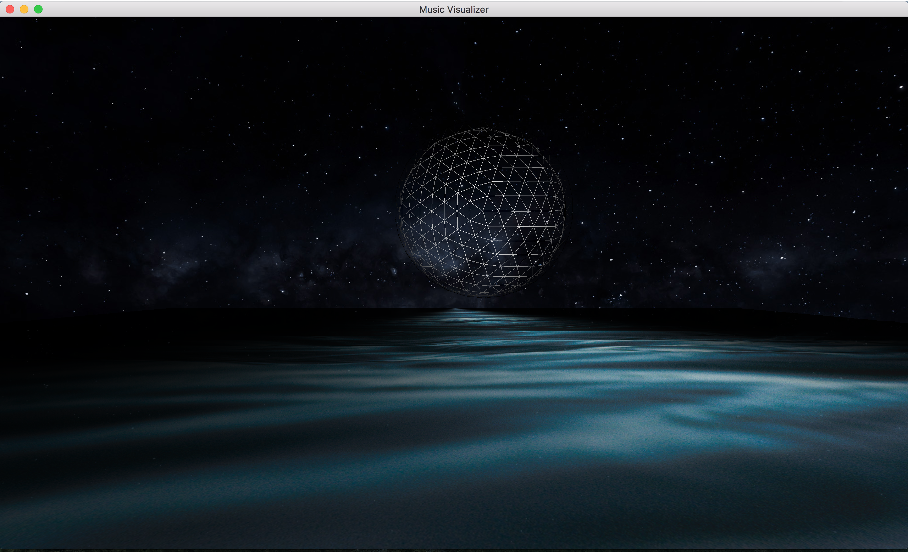
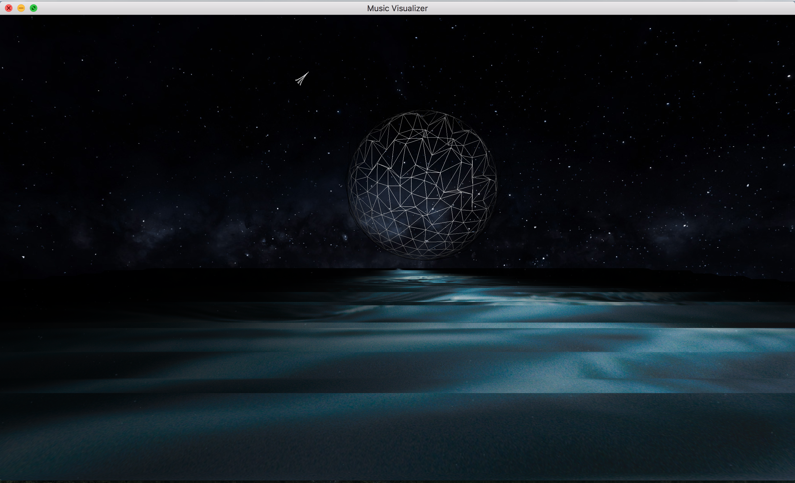

# Real Time 3D Music Visualizer

I made a real time 3D music visualizer for my final project in my Intro to Computer Graphics course (CPE 471).

For the graphics I used OpenGL, glfw, glew, and the Cocoa framework.
For the audio I used OpenAL, alut, and the Accelerate framework. (So this will only build on a mac)

My program reads in audio from my laptop's microphone, performs an fft on this audio, and creates dynamic textures in real time.

Ideally the program would read audio from the hardware, but my mac wouldn't allow me to do so.

I used heightmapping to create the dynamic audio textures. 

You can move around with the wasd keys.

# To build (on macs only)

You need glfw3, glew, glm, alut, cmake, and Xcode. I recommend installing all of these with homebrew.

Edit the CMakeLists.txt file so the search paths for alut, glfw, glew, and glm point to your specific installation path.

ex: (set ALUT_DIR $ENV{ALUT_DIR}) -> (set ALUT_DIR /usr/local/Cellar/freealut/1.1.0)

